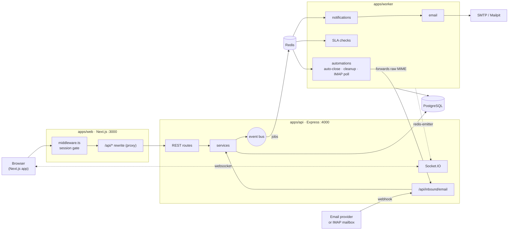
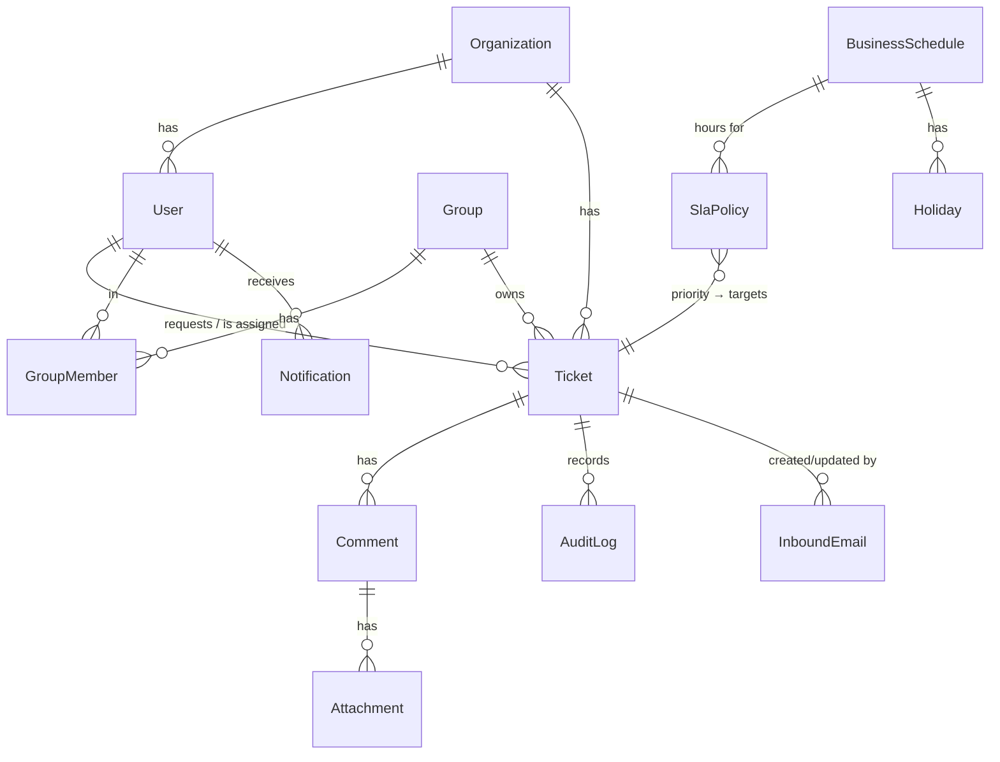

# Architecture

## System overview



### Why three processes?

| Process | Owns | Scale by |
| --- | --- | --- |
| **web** | UI, route gating, proxying `/api/*` to the API (same-origin cookies, no CORS) | replicas |
| **api** | Request handling, validation, permissions, DB writes, realtime fan-out | replicas (Socket.IO uses the Redis adapter) |
| **worker** | Anything slow, retryable or scheduled: email, SLA timers, automations, IMAP | replicas (BullMQ distributes jobs) |

Users never wait on email delivery or SLA bookkeeping, and a crashed worker retries its jobs instead of losing them.

## Request lifecycle: "agent assigns a ticket"

```mermaid
sequenceDiagram
  participant UI as Web UI
  participant API as API (routes → service)
  participant DB as Postgres
  participant Bus as Event bus
  participant Q as BullMQ (Redis)
  participant W as Worker
  UI->>API: PATCH /api/tickets/42 {assigneeId}
  API->>API: zod parse (shared schema) + rules.assertCanUpdate
  API->>DB: BEGIN; UPDATE ticket; INSERT audit_log; COMMIT
  API-->>UI: 200 updated ticket
  API->>Bus: emit ticket.updated (after commit)
  Bus->>UI: socket "ticket:changed" {ticketId} → UI refetches
  Bus->>Q: notifications job (assignee)
  Q->>W: process → in-app row + email job → SMTP
```

## Code map

```
apps/api/src
  config/env.ts          zod-validated env. Boot fails fast on bad config
  middleware/            auth (JWT cookie), error handler
  modules/<feature>/     routes.ts (thin HTTP layer) + service.ts (logic)
    tickets/rules.ts     ★ pure business rules: visibility, permissions, transitions
    tickets/service.ts   ★ ticket commands/queries; transactions + audit
    inbound/service.ts   ★ email-to-ticket pipeline
    sla/routes.ts        admin config: SLA policies, business schedules, holidays
  events/bus.ts          in-process domain events
  events/subscribers.ts  side effects: realtime, SLA scheduling, notifications
  realtime/socket.ts     Socket.IO server, room auth
apps/worker/src
  processors/            notifications, email, sla, automations, imap
apps/web/src
  app/                   App Router pages: login, (app)/tickets, (app)/admin
  components/            UI. ticket/* is the ticket workspace
  hooks/queries.ts       ★ all TanStack Query hooks + query keys
  lib/api.ts             typed fetch client
  lib/realtime.tsx       socket → query invalidation
packages/shared/src      enums, zod schemas, DTO types, queue/socket contracts, sla.ts, email.ts
packages/db/prisma       schema.prisma, migrations/, seed.ts
```

## Data model



Notes:
- `Ticket.number` is the human ID (`#42`). URLs and the API accept either the number or the cuid.
- SLA state lives **on the ticket** (`firstResponseDueAt`, `resolutionDueAt`, `*Breached`, `slaBusinessHours`), so list views sort and filter without joins. Due dates are computed once (business-hours aware, see [sla.md](./sla.md)) and stored.
- `Comment.isPublic=false` is an internal note. `Comment.via` is `WEB` or `EMAIL`.
- `AuditLog.changes` is JSON: `{ field: { from, to } }`. `actorId = null` means the system did it (SLA worker, automations).
- `InboundEmail` has one row per received email. It dedupes by `messageId` and records the outcome.

## Key design decisions

| Decision | Why |
| --- | --- |
| **Business rules are pure functions** (`tickets/rules.ts`) | Easy to unit test, and a single place to review "who can do what". |
| **Audit row written in the same transaction** as the change | The audit trail can never disagree with the data. |
| **Side effects run off an event bus, after commit** | Services stay focused, and new reactions (Slack, webhooks) are just new subscribers. *Trade-off:* a crash between commit and emit drops that side effect. A transactional outbox is on the roadmap. |
| **Socket events carry IDs only.** Clients refetch over REST | Permission logic (internal notes!) lives in one place. Sockets can't leak data. |
| **SLA = one delayed BullMQ job per metric** | Fires exactly at the deadline, no cron scanning every ticket. The worker re-checks the DB, so stale jobs are harmless. |
| **404 (not 403)** for tickets you can't see | Ticket IDs can't be enumerated. |
| **Shared zod schemas** for API validation and UI forms | One definition. The frontend and backend can't drift. |
| **Attachments always download** (`Content-Disposition: attachment`) | Blocks stored XSS through uploaded HTML/SVG. |
| **Email ingestion reuses the ticket service** | Email tickets get SLA, notifications, audit and realtime for free. |
| **Staff email replies become internal notes** | Agent notification emails quote internal notes, so a careless "reply" must not leak them. |

## Realtime

- On connect, the socket joins `user:<id>`, and staff also join `staff`. Opening a ticket joins `ticket:<id>` after a permission check.
- Server events: `ticket:changed`, `tickets:changed`, `notification:new`. Each one makes the client invalidate the matching React Query keys (`lib/realtime.tsx`).
- The worker emits through `@socket.io/redis-emitter`, and the API's Redis adapter delivers to clients on any API replica.

## Background jobs

| Queue | Job | Trigger | Notes |
| --- | --- | --- | --- |
| `notifications` | fan-out | domain events | Creates in-app rows, then one `email` job per recipient |
| `email` | send | notifications | 8 attempts, exponential backoff, per recipient |
| `sla` | `check` | ticket created / priority or status change / first reply | Delayed until the due time. Idempotent conditional update. |
| `automations` | `auto-close` | every 15 min | SOLVED → CLOSED after `AUTO_CLOSE_AFTER_HOURS` |
| `automations` | `cleanup-uploads` | hourly | Deletes uploads never attached to a ticket (>24 h) |
| `automations` | `imap-poll` | every `IMAP_POLL_SECONDS` | Only when IMAP is configured |

Next: [Development guide](./development-guide.md)
